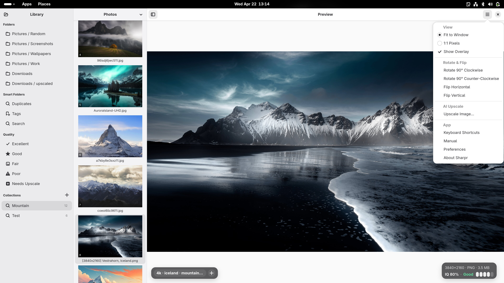
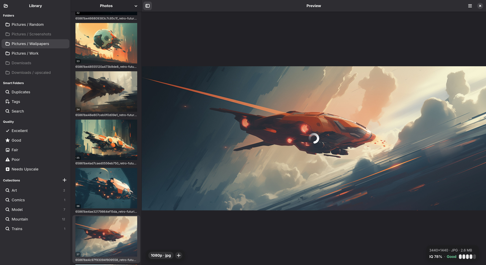

# Sharpr

<p align="center">
  A high-performance, local-first image curation tool and viewer for Linux, built with GTK4, Libadwaita, and Rust.
</p>

---

<p align="center">
  
</p>

<p align="center">
  
</p>

---

## What is Sharpr?

Sharpr is a modern desktop application designed to help you browse, organize, and curate large local image libraries without the overhead of a heavy, monolithic database. 

Instead of locking your photos into a proprietary catalog, Sharpr treats your file system as the ultimate source of truth. It uses industry-standard metadata (EXIF/XMP tags) to build lightning-fast virtual collections and robust filtering workflows.

### What it does

- **Instant Browsing:** Open massive folders of images instantly. Sharpr loads thumbnails in the background and uses local caching for zero-latency navigation.
- **Tag-Backed Collections:** Virtual Collections are backed by tags stored in a local SQLite database — your image files are never modified by tagging or organisation operations. Your library stays exactly as you left it on disk.
- **Sorting & Quality Filtering:** Sort and filter the active folder directly from the filmstrip drop-down menu. You can order images by date or name, and stack quality filters to instantly cull your view.
- **Intelligent Curation:** Detect duplicate images via perceptual hashing and automatically score image quality to help you quickly cull bad shots.
- **Native AI Upscaling:** Seamlessly run local AI models (like `realesrgan-ncnn-vulkan` or ComfyUI) to upscale and enhance images directly from the viewer.
- **GNOME-Native Design:** Built on GTK4 and Libadwaita, Sharpr offers an adaptive, deeply integrated, and visually polished experience on Linux.
- **Quick Operations:** Rotate, flip, pan, zoom (including a 1:1 pixel view), and safely move rejected images to the system trash.

## How it works

Sharpr is built around a strict separation of **Navigation** and **Viewing**:
1. **The Sidebar (Where am I?):** Use the left sidebar to select your scope. Browse physical directories on your hard drive or view your curated Collections.
2. **The Filmstrip (What am I seeing?):** Once you've selected a location, use the filmstrip's menu to narrow down the view. Sort by name or date, and filter by quality ratings without losing your place in the folder tree.

All organisational data (tags, collections, quality scores) lives in a sidecar SQLite database at `~/.local/share/sharpr/`. Image files are only ever written to when you explicitly perform a destructive operation such as rotate, flip, upscale, or move to trash.

## Requirements

- GNOME 48 runtime (Flatpak) **or** GTK 4.14+ / Libadwaita 1.5+ natively
- For AI upscaling: `realesrgan-ncnn-vulkan` binary with model files in a `models/` subdirectory next to the binary, or a configured ComfyUI instance.

## Building

### Flatpak (recommended)

```bash
cd sharpr/packaging
flatpak-builder --force-clean --user --install build-dir io.github.hebbihebb.Sharpr.yml
flatpak run io.github.hebbihebb.Sharpr
```

> **Note:** `cargo-sources.json` must be present. Regenerate it after any `Cargo.lock` change:
> ```bash
> flatpak-cargo-generator ../Cargo.lock -o cargo-sources.json
> ```

### Native (development)

```bash
cd sharpr

# Install dependencies (Fedora example)
sudo dnf install gtk4-devel libadwaita-devel gexiv2-devel pkg-config gcc

cargo build
```

GSettings schemas must be compiled before running natively:
```bash
glib-compile-schemas data/
GSETTINGS_SCHEMA_DIR=data cargo run
```

## Keyboard shortcuts

| Key | Action |
|-----|--------|
| Alt+Left / Alt+Right | Previous / Next image |
| Ctrl+Scroll | Zoom in/out |
| Ctrl+0 | Reset to Fit |
| Z | Toggle 1:1 Pixels |
| F11 | Toggle fullscreen |
| Delete | Move to trash |
| Ctrl+T | Open tag editor |
| Alt+Return | Toggle viewer overlays |
| Ctrl+, | Open Preferences |
| ? | Show all shortcuts |

## License

GPL-3.0-or-later