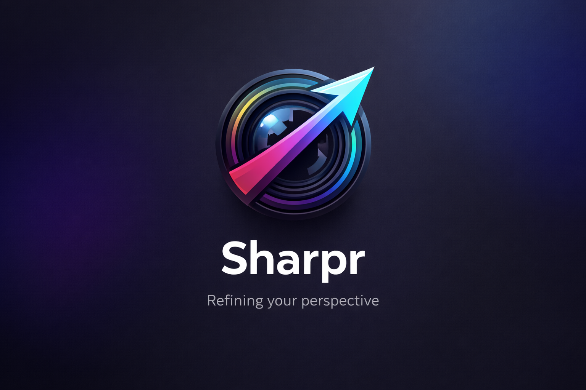

# Sharpr

<p align="center">
  
</p>

<p align="center">
  A fast, keyboard-friendly image viewer for GNOME — built with GTK4, Libadwaita, and Rust.
</p>

---

## Features

- **Filmstrip sidebar** — browse a folder's images with thumbnail previews
- **Smooth zoom & pan** — scroll to zoom, drag to pan; Fit and 1:1 toggle
- **Rotate & flip** — in-memory transforms with save-to-disk (Edit menu)
- **AI upscaling** — one-click upscale via Real-ESRGAN (Standard or Anime/Art model); before/after comparison slider
- **Duplicate detection** — dHash-based near-duplicate grouping; Smart Folders sidebar
- **Metadata overlay** — EXIF data via gexiv2
- **Keyboard navigation** — arrow keys, F11 fullscreen, Delete to trash, and more
- **Prefetch** — background decode of adjacent images for instant navigation

## Requirements

- GNOME 48 runtime (Flatpak) **or** GTK 4.14+ / Libadwaita 1.5+ natively
- For AI upscaling: `realesrgan-ncnn-vulkan` binary with model files in a `models/` subdirectory next to the binary

## Building

### Flatpak (recommended)

```bash
cd sharpr/packaging
flatpak-builder --force-clean --user --install build-dir io.github.hebbihebb.Sharpr.yml
flatpak run io.github.hebbihebb.Sharpr
```

> **Note:** `cargo-sources.json` must be present. Regenerate it after any `Cargo.lock` change:
> ```bash
> flatpak-cargo-generator ../Cargo.lock -o cargo-sources.json
> ```

### Native (development)

```bash
cd sharpr

# Install dependencies (Fedora example)
sudo dnf install gtk4-devel libadwaita-devel gexiv2-devel

cargo build
```

GSettings schemas must be compiled before running natively:
```bash
glib-compile-schemas data/
GSETTINGS_SCHEMA_DIR=data cargo run
```

## AI Upscaling setup

Download the `realesrgan-ncnn-vulkan` binary and place model files alongside it:

```
~/.local/bin/
  realesrgan-ncnn-vulkan
  models/
    realesrgan-x4plus.param
    realesrgan-x4plus.bin
    realesrgan-x4plus-anime.param
    realesrgan-x4plus-anime.bin
```

The Flatpak build bundles the binary and models automatically.

## Keyboard shortcuts

| Key | Action |
|-----|--------|
| ← / → | Previous / Next image |
| Scroll | Zoom in/out |
| Z | Toggle Fit / 1:1 zoom |
| F11 | Toggle fullscreen |
| Delete | Move to trash |
| Ctrl+S | Save edit |
| ? | Show all shortcuts |

## License

GPL-3.0-or-later
