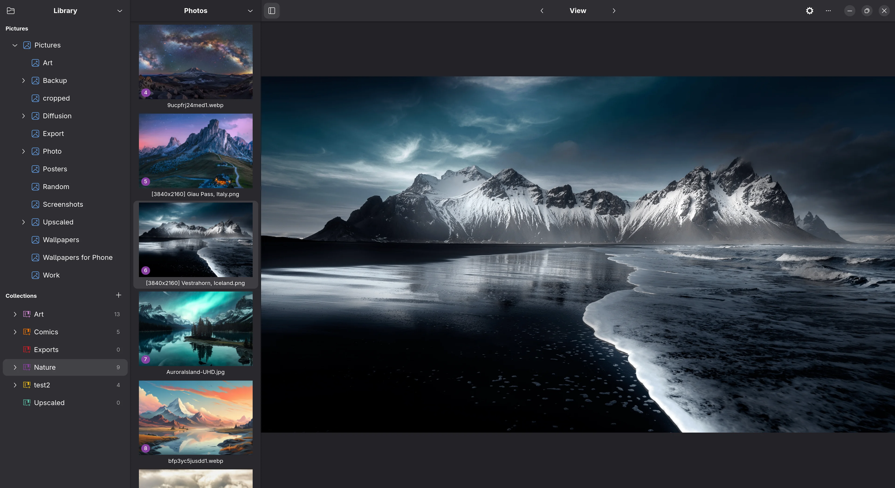

# Sharpr

A high-performance, local-first image curation tool and viewer for Linux, built with GTK4, Libadwaita, and Rust.



## Features

- **Zero-Latency Navigation:** Browse massive folders instantly with chunked loading and background thumbnail caching.
- **Modern Image Pipeline:** Secure, sandboxed image decoding via [Glycin](https://gitlab.gnome.org/GNOME/glycin), providing robust format support.
- **Pro Curation Workflow:** Organize images with virtual collections, smart tagging, and quality scoring—all stored in a local SQLite database so your original files remain untouched.
- **Intelligent Tools:** Detect duplicates via perceptual hashing and enhance images with local AI models (NCNN or ComfyUI).
- **Modern Linux Native:** Built with GTK4 and Libadwaita for a deeply integrated, adaptive GNOME experience.

## Getting Started

### Flatpak (Recommended)

**First-time setup:**

```bash
# Install flatpak-builder
sudo dnf install flatpak-builder        # Fedora
# or: sudo apt install flatpak-builder  # Ubuntu/Debian

# Install the required runtime and Rust SDK extension
flatpak install --user flathub \
  org.gnome.Platform//50 \
  org.gnome.Sdk//50 \
  org.freedesktop.Sdk.Extension.rust-stable//25.08
```

**Build and run:**

```bash
cd sharpr/packaging

# Sync source tree
bash sync-flatpak-source.sh

# Regenerate cargo sources (only needed when Cargo.lock changes)
flatpak-cargo-generator ../Cargo.lock -o cargo-sources.json

# Build and install (~6 min first time)
flatpak-builder --force-clean --user --install build-dir io.github.hebbihebb.Sharpr.yml

flatpak run io.github.hebbihebb.Sharpr
```

> **Note:** The build is capped at 4 parallel jobs to prevent RAM exhaustion from the C++ vendored dependencies. Do not remove `--jobs 4` from the manifest.

### Native Development

**Dependencies (Fedora):**

```bash
sudo dnf install gtk4-devel libadwaita-devel gexiv2-devel pkg-config gcc
```

**Run:**

```bash
cd sharpr
glib-compile-schemas data/
GSETTINGS_SCHEMA_DIR=data cargo run
```

**Release build:**

```bash
cargo build --release
```

## Shortcuts

| Key | Action |
|-----|--------|
| Alt+Left / Right | Previous / Next image |
| Ctrl+Scroll / 0 | Zoom / Reset to Fit |
| Z | Toggle 1:1 Pixels |
| F11 | Toggle Fullscreen |
| Delete | Move to Trash |
| Ctrl+T | Open Tag Editor |
| ? | Show all shortcuts |

## License

GPL-3.0-or-later
